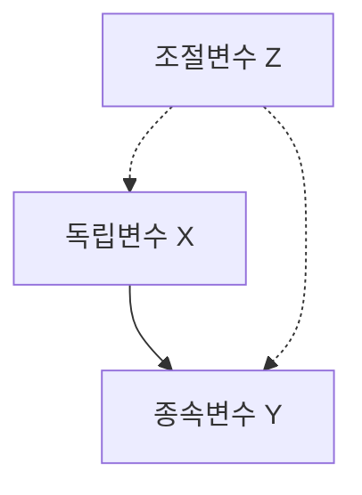
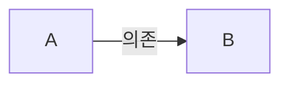

```markdown
---
title: Diagrams with mermaid.js
date: 2023-08-31
layout: post
mermaid: true
---
```

Then you can use mermaid syntax in your markdown:


```mermaid
graph LR
  X[독립변수 X] --> M[매개변수 M] --> Y[종속변수 Y]
  X --> Y

```


```mermaid
graph TD
  X[독립변수 X] --> Y[종속변수 Y]
  Z[조절변수 Z] -.-> Y
  Z -.-> X
```


```mermaid
flowchart LR
    A-->|의존|B
```
