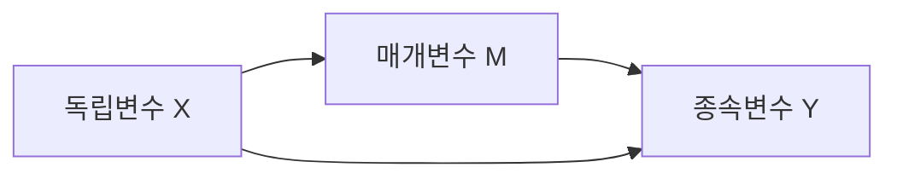
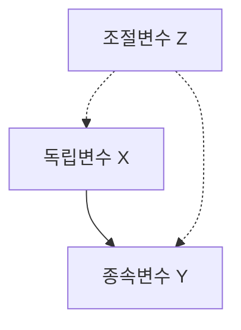
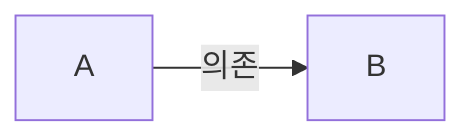

```markdown
---
title: Diagrams with mermaid.js
date: 2023-08-31
layout: post
mermaid: true
---
```

Then you can use mermaid syntax in your markdown:







```mermaid
graph LR
  %% 측정 모델 (Measurement Model)
  x[Latent Variable: x] --> x1[x1]
  x --> x2[x2]
  x --> x3[x3]

  z[Latent Variable: z] --> z1[z1]
  z --> z2[z2]
  z --> z3[z3]
  z --> z4[z4]

  y[Latent Variable: y] --> y1[y1]
  y --> y2[y2]

  mo[Latent Variable: mo] --> mo1[mo1]
  mo --> mo2[mo2]
  mo --> mo3[mo3]
  mo --> mo4[mo4]

  me[Latent Variable: me] --> me1[me1]
  me --> me2[me2]
  me --> me3[me3]

  %% 조절 효과 (Interaction Effect)
  x_mo[Interaction: x_mo] --> x1.mo1[x1.mo1]
  x_mo --> x1.mo2[x1.mo2]
  x_mo --> x1.mo3[x1.mo3]
  x_mo --> x1.mo4[x1.mo4]
  
  x_mo --> x2.mo1[x2.mo1]
  x_mo --> x2.mo2[x2.mo2]
  x_mo --> x2.mo3[x2.mo3]
  x_mo --> x2.mo4[x2.mo4]
  
  x_mo --> x3.mo1[x3.mo1]
  x_mo --> x3.mo2[x3.mo2]
  x_mo --> x3.mo3[x3.mo3]
  x_mo --> x3.mo4[x3.mo4]

  %% 경로 모형 (Path Model)
  y -->|Regression| x
  y -->|Regression| z
  y -->|Regression| me
  y -->|Regression| mo
  y -->|Regression| x_mo
  me -->|Regression| x
  ```


```mermaid
graph TD
  A[변수 유형] --> B[단일 변수 분석]
  A --> C[두 변수 간 분석]
  A --> D[다중 변수 분석]

  B --> B1[연속형: 평균, 표준편차, 정규성 검정]
  B --> B2[범주형: 빈도분석, 카이제곱 검정]

  C --> C1[연속형 vs. 연속형: 상관분석, 회귀분석]
  C --> C2[연속형 vs. 범주형: t-검정, ANOVA]
  C --> C3[범주형 vs. 범주형: 카이제곱 검정, 피셔의 정확 검정]

  D --> D1[회귀 분석: 다중선형 회귀, 로지스틱 회귀]
  D --> D2[요인 분석: EFA, CFA]
  D --> D3[군집 분석: K-means, 계층적 군집]
  D --> D4[분산분석: ANOVA, MANOVA]
  D --> D5[기타 다변량 기법: PCA, SEM]
```
