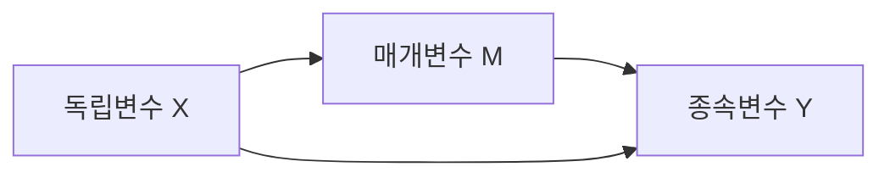
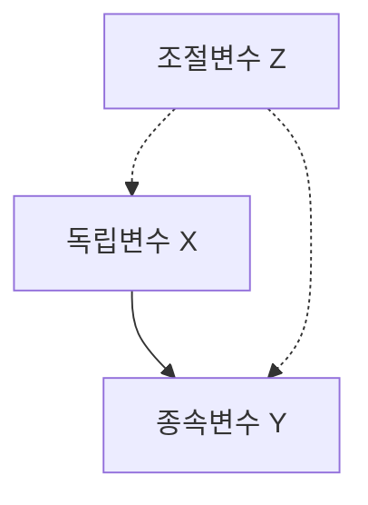
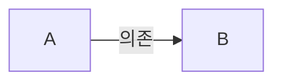

```markdown
---
title: Diagrams with mermaid.js
date: 2023-08-31
layout: post
mermaid: true
---
```

Then you can use mermaid syntax in your markdown:







```mermaid
graph LR
  %% 측정 모델 (Measurement Model)
  x[Latent Variable: x] --> x1[x1]
  x --> x2[x2]
  x --> x3[x3]

  z[Latent Variable: z] --> z1[z1]
  z --> z2[z2]
  z --> z3[z3]
  z --> z4[z4]

  y[Latent Variable: y] --> y1[y1]
  y --> y2[y2]

  mo[Latent Variable: mo] --> mo1[mo1]
  mo --> mo2[mo2]
  mo --> mo3[mo3]
  mo --> mo4[mo4]

  me[Latent Variable: me] --> me1[me1]
  me --> me2[me2]
  me --> me3[me3]

  %% 조절 효과 (Interaction Effect)
  x_mo[Interaction: x_mo] --> x1.mo1[x1.mo1]
  x_mo --> x1.mo2[x1.mo2]
  x_mo --> x1.mo3[x1.mo3]
  x_mo --> x1.mo4[x1.mo4]
  
  x_mo --> x2.mo1[x2.mo1]
  x_mo --> x2.mo2[x2.mo2]
  x_mo --> x2.mo3[x2.mo3]
  x_mo --> x2.mo4[x2.mo4]
  
  x_mo --> x3.mo1[x3.mo1]
  x_mo --> x3.mo2[x3.mo2]
  x_mo --> x3.mo3[x3.mo3]
  x_mo --> x3.mo4[x3.mo4]

  %% 경로 모형 (Path Model)
  y -->|Regression| x
  y -->|Regression| z
  y -->|Regression| me
  y -->|Regression| mo
  y -->|Regression| x_mo
  me -->|Regression| x
  ```


```mermaid
graph LR
  %% 변수의 종류
  A[변수의 종류] -->|명목 변수| B1[명목 변수 (Categorical)]
  A -->|서열 변수| B2[서열 변수 (Ordinal)]
  A -->|등간 변수| B3[등간 변수 (Interval)]
  A -->|비율 변수| B4[비율 변수 (Ratio)]

  %% 명목 변수 관련 통계
  B1 -->|기초 통계| C1[빈도 (Frequency)]
  B1 --> C2[최빈값 (Mode)]
  B1 --> C3[카이제곱 검정 (Chi-square Test)]
  B1 -->|회귀 분석| C4[로지스틱 회귀 (Logistic Regression)]

  %% 서열 변수 관련 통계
  B2 -->|기초 통계| D1[중앙값 (Median)]
  B2 --> D2[사분위 범위 (IQR)]
  B2 --> D3[스피어만 상관계수 (Spearman's ρ)]
  B2 -->|회귀 분석| D4[순위 기반 회귀 (Ordinal Regression)]

  %% 등간 변수 관련 통계
  B3 -->|기초 통계| E1[평균 (Mean)]
  B3 --> E2[표준편차 (Standard Deviation)]
  B3 --> E3[피어슨 상관계수 (Pearson's r)]
  B3 --> E4[t-검정 (t-test)]
  B3 --> E5[ANOVA (분산 분석)]
  B3 -->|회귀 분석| E6[선형 회귀 (Linear Regression)]
  B3 --> E7[다중 회귀 (Multiple Regression)]

  %% 비율 변수 관련 통계
  B4 -->|기초 통계| F1[평균 (Mean)]
  B4 --> F2[표준편차 (Standard Deviation)]
  B4 --> F3[피어슨 상관계수 (Pearson's r)]
  B4 --> F4[t-검정 (t-test)]
  B4 --> F5[ANOVA (분산 분석)]
  B4 --> F6[비율 계산 (Ratio Calculation)]
  B4 -->|회귀 분석| F7[선형 회귀 (Linear Regression)]
  B4 --> F8[다중 회귀 (Multiple Regression)]

  %% 회귀 분석 추가
  G[회귀 분석 (Regression Analysis)] --> H1[선형 회귀 (Linear Regression)]
  G --> H2[다중 회귀 (Multiple Regression)]
  G --> H3[로지스틱 회귀 (Logistic Regression)]
  G --> H4[순위 기반 회귀 (Ordinal Regression)]
  G --> H5[프로빗 회귀 (Probit Regression)]
  G --> H6[포아송 회귀 (Poisson Regression)]
  G --> H7[혼합효과 모형 (Mixed-Effects Model)]

  %% 회귀 분석이 해당 변수들과 연결
  B3 -.->|사용| G
  B4 -.->|사용| G
  B1 -.->|사용 (이항 로지스틱)| H3
  B2 -.->|사용 (순위 기반)| H4

```
